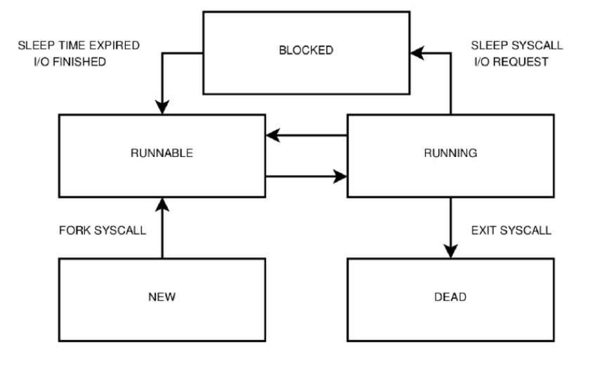
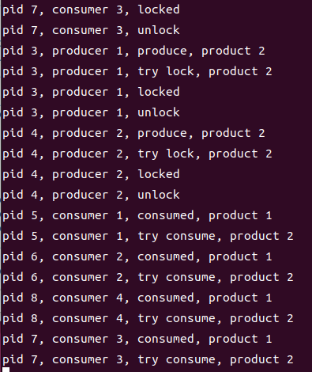

# lab1  
## 实验目的  
1. 实现一个简单的应用程序，并在其中调用两个自定义实现的系统调用。
2. 了解基于中断实现系统调用的全过程。
## 实验内容      
1. 内核初始化。    
2. 内核态向用户态的跳转（原实验为：Bootloader 从实模式进入保护模式，加载内核至内存，并跳转执行，内核加载用户程序至内存，对内核堆栈进行设置，通过 iret 切换至用户空间，执行用户程序。）  
3. 用户程序调用自定义实现的库函数 scanf 完成格式化输入和 printf 完成格式化输出。  
4. scanf 基于中断陷入内核，内核扫描按键状态获取输入完成格式化输入（现阶段不需要考虑键盘中断）。  
5. printf 基于中断陷入内核，由内核完成在视频映射的显存地址中写入内容，完成字符串的打印。
## 实验过程    
### 内核态初始化
#### kinit()  
1. 初始化锁。  
2. 初始化可用内存范围，将物理内存范围 [RAMBASE, RAMSTOP]标记为空闲可用。
#### vminit()  
1. 分配一页物理内存作为内核页表，并清空页表内容(0)。  
2. 为进程设置内核栈的虚拟地址映射。  
3. 将内核页的物理地址写入pgdl寄存器。  
4. 初始化tlb。  
5. 设置了遍历页表的参数。  
#### trapinit()  
1. 初始化锁。
2. 配置异常配置寄存器ECFG，当中断发生时，CPU跳转到不同的处理函数，而不是统一的异常入口。  
3. 配置定时器配置寄存器TCFG，定时器每计数0x1000000个CPU周期就触发一次中断。  
4. 设置异常入口点，发生异常时，CPU跳转到kernelvec开始执行。  
5. 设置TLB重填入口，当页表缺页时调用。  
6. 设置机器错误异常处理入口，硬件错误时调用。  
7. 开启中断。  
#### apic_init()  
1. 配置uart0串口中断，只允许uart0中断，屏蔽其他所有硬件中断。  
#### extioi_init()  
1. 使能中断。  
#### binit()  
构建双向循环链表。  
双向循环链表：每个节点都有两个指针，一个指向前一个节点，一个指向后一个节点，因此可以从任意一个节点开始，双向遍历整个链表。  
  

####  userinit()  
1. 分配用户进程。  
2. 将init程序的代码和数据映射到用户地址空间，设置用户态执行上下文，为第一次内核返回用户态做准备。  
3. 设置进程名称，工作目录，进程状态，准备开启调度。  
### 内核态向用户态跳转
调度器遍历所有进程，找到状态为runnable的进程，设置状态为running，进行上下文的切换，跳转到p->context.ra所设置的forkret函数，先进行文件系统初始化，读取超级块进行魔数判断，成功后进入usertrapret()，设置下次trap的入口，保存内核状态到陷阱帧，设置返回地址，获取用户页表物理地址，进入userret(),通过ertn跳转到用户态。

### 用户态  
在init.c中调用了printf和scanf函数，下面分别阐明调用过程和实现机制。

#### printf  
```c
void
printf(const char *fmt, ...)
{
  va_list ap; 
  va_start(ap, fmt); 
  vprintf(1, fmt, ap);
}
```
通过va_start(ap, fmt)指向第一个可变参数，进入vprintf。
```c
void
vprintf(int fd, const char *fmt, va_list ap)
{
  char *s;
  int c, i, state;

  state = 0;
  for(i = 0; fmt[i]; i++){
    c = fmt[i] & 0xff;
    if(state == 0){
      if(c == '%'){
        state = '%';
      } else {
        putc(fd, c);
      }
    } else if(state == '%'){
      if(c == 'd'){
        printint(fd, va_arg(ap, int), 10, 1);
      } else if(c == 'l') {
        printint(fd, va_arg(ap, uint64), 10, 0);
      } else if(c == 'x') {
        printint(fd, va_arg(ap, int), 16, 0);
      } else if(c == 'p') {
        printptr(fd, va_arg(ap, uint64));
      } else if(c == 's'){
        s = va_arg(ap, char*);
        if(s == 0)
          s = "(null)";
        while(*s != 0){
          putc(fd, *s);
          s++;
        }
      } else if(c == 'c'){
        putc(fd, va_arg(ap, uint));
      } else if(c == '%'){
        putc(fd, c);
      } else {
        // Unknown % sequence.  Print it to draw attention.
        putc(fd, '%');
        putc(fd, c);
      }
      state = 0;
    }
  }
}
```
分为state==0和state==%两种情况，当state==0时，直接输出，当state==%时对下一个字符进行判断，分别是%d - 十进制有符号整数，%l - 十进制无符号长整数，%x - 十六进制无符号整数，%p - 指针地址，%s - 字符串，%c - 字符，%% - 百分号字符，va_arg(ap,type)，得到当前ap所指向的可变参数的值，并将ap指向下一个可变参数。
##### 对于整数调用printint函数：
```c
static void
printint(int fd, int xx, int base, int sgn)
{
  char buf[16];
  int i, neg;
  uint x;

  neg = 0;
  if(sgn && xx < 0){
    neg = 1;
    x = -xx;
  } else {
    x = xx;
  }

  i = 0;
  do{
    buf[i++] = digits[x % base];
  }while((x /= base) != 0);
  if(neg)
    buf[i++] = '-';

  while(--i >= 0)
    putc(fd, buf[i]);
}
```
base表示进制基数，sgn表示是否处理符号（1=有符号，0=无符号）、首先进行符号判断，如果是有符号，且数字<0，先按照正数处理，最后再加“-”。定义数组static char digits[] = "0123456789ABCDEF"；逆序将每个字符放入数组，再逆序输出。
##### 对于指针地址调用printptr函数：
```c
static void
printptr(int fd, uint64 x) {
  int i;
  putc(fd, '0');
  putc(fd, 'x');
  for (i = 0; i < (sizeof(uint64) * 2); i++, x <<= 4)
    putc(fd, digits[x >> (sizeof(uint64) * 8 - 4)]);
}
```
##### 对于字符或者字符串使用va_arg()，然后putc输出。
putc函数：
```c
static void
putc(int fd, char c)
{
  write(fd, &c, 1);
}
```
当调用write时
```
.global write
write:
li.d $a7, SYS_write
syscall 0
jirl $zero, $ra, 0
```
向a7寄存器写入SYS_write，之后硬件保存 PC+4 到 CSR_ERA，保存当前状态到 CSR_PRMD，切换到内核特权级（PLV=0），禁用中断，跳转到 CSR_EENTRY 指定的地址（我们设置的是 w_csr_eentry((uint64)uservec)）。进入usertrap()，进入syscall（）函数。  
```c
void
syscall(void)
{
  int num;
  struct proc *p = myproc();

  num = p->trapframe->a7;
  if(num > 0 && num < NELEM(syscalls) && syscalls[num]) {
    p->trapframe->a0 = syscalls[num]();
  } else {
    printf("%d %s: unknown sys call %d\n",
            p->pid, p->name, num);
    p->trapframe->a0 = -1;
  }
}
```
通过p->trapframe->a0 = syscalls[num]()进入sys_write函数。  
```c
uint64
sys_write(void)
{
  struct file *f;
  int n;
  uint64 p;

  if(argfd(0, 0, &f) < 0 || argint(2, &n) < 0 || argaddr(1, &p) < 0)
    return -1;
  return filewrite(f, p, n);
}
```
通过if(argfd(0, 0, &f) < 0 || argint(2, &n) < 0 || argaddr(1, &p) < 0)获取参数，包括fd、字节数、用户地址，传入 filewrite函数。因为打开的是设备文件，所以ret = devsw[f->major].write(1, addr, n);
在console.c中的consoleinit中devsw[CONSOLE].write = consolewrite;所以进入consolewrite函数：
```c
int
consolewrite(int user_src, uint64 src, int n)
{
  int i;

  for(i = 0; i < n; i++){
    char c;
    if(either_copyin(&c, user_src, src+i, 1) == -1)
      break;
    uartputc(c);
  }

  return i;
}
```
uartputc->uartstart->WriteReg，qemu通过读取寄存器将内容打印到控制台。
scanf调用的是read逻辑与write相同不做描述。
#### main
```c
int
main(void)
{
    if(open("console", O_RDWR) < 0){
        mknod("console", CONSOLE, 0);
        open("console", O_RDWR);
    }
    dup(0);  // stdout
    dup(0);  // stderr
//lab2
    int num=0;
    printf("write a num\n");
    scanf("%d", &num);  
    printf("what u write num is: %d\n", num);
    printf("lab2 success\n");


   
    while(1){
    }
    return 0;
}
```
测试printf和scanf函数。   
## 实验结果  
  
# lab2
## 实验目的
1. 实现一个简单的任务调度。
2. 介绍基于时间中断进行进程切换以及纯用户态的非抢占式的线程切换完成任务调度的全过程。
## 实验内容
1. 内核：实现进程切换机制，并提供系统调用 fork、sleep、exit。
2. 库：对上述系统调用进行封装；实现一个用户态的线程库，完成 pthread_create、
pthread_join、pthread_yield、pthread_exit 等接口。
3. 用户：对上述库函数进行测试。
## 背景知识
### 进程与线程
进程为操作系统资源分配的单位，每个进程都有独立的地址空间（代码段、数据段），独立的堆栈，独立的进程控制块；线程作为任务调度的基本单位，与进程的唯一区别在于其地址空间并非独立，而是与其他线程共享(创建这些线程的“进程”的地址空间)。以下为一个广义的进程（包括进程与线程）生命周期中的状态转换图。    
  

(1) 进程由其父进程利用 FORK 系统调用创建，则该进程进入 RUNNABLE 状态。  
(2) 时间中断到来，RUNNABLE 状态的进程被切换到，则该进程进入 RUNNING 状态。
(3) 时 间 中断 到来，RUNNING 状 态的进程 处理时间 片耗尽， 则该进程 进入
RUNNABLE 状态。  
(4) RUNNING 状态的进程利用 SLEEP 系统调用主动阻塞；或利用系统调用等待硬
件 I/O，则该进程进入 BLOCKED 状态。  
(5) 时间中断到来，BLOCKED 状态的进程的 SLEEP 时间片耗尽；或外部硬件中断
表明 I/O 完成，则该进程进入 RUNNABLE 状态。  
(6) RUNNING 状态的进程利用 EXIT 系统调用主动销毁，则该进程进入 DEAD 状态。  

### 进程切换与堆栈切换  
:::{list-table} 时间中断与进程切换流程详解
:widths: 25 75
:header-rows: 1

* - **阶段**
  - **详细动作与状态**
* - 时间中断发生前
  - P1 用户态执行
    堆栈：P1 用户栈
    时间片：还剩 5ms
* - 时间中断发生！
    *(硬件自动完成)*
  - 1. 保存 PC 到 EPC/ERA 寄存器
    2. 切换特权级到内核态
    3. 跳转到异常向量地址
* - 进入异常向量
    *(汇编代码)*
  - 1.  立即设置堆栈为 P1 内核栈！
    2. 保存所有用户寄存器到内核栈
    3. 调用 C 语言中断处理程序
* - C 语言中断处理程序
  - 1. 更新时间统计
    2. 减少时间片计数：`P1.time_slice--`
    3. 检查时间片是否耗尽
       `if (P1.time_slice <= 0) { 设置重新调度标志 }`
    4. 如果需要，触发调度
* - 如果需要进程切换
  - 1. 保存 P1 内核上下文到 `task_struct`
    2. 选择 P2 为下一个进程
    3. 切换到 P2 的内核栈
    4. 从 P2 内核栈恢复 P2 的上下文
* - 中断返回
  - 1. 从内核栈恢复用户寄存器
    2. 返回到 P2 用户态执行
    堆栈：P2 用户栈
:::
(1) 进程 P1 在用户态执行，中断发生后，硬件自动操作:
1. 保存PC到CSR_ERA。  
2. 设置CRMD.PLV=0 (进入内核态)。  
3. 跳转到异常向量地址。  
在异常向量中，从 P1 的用户态堆栈切换至 P1 的内核堆栈，并将 P1 的现场信息压入内核堆栈中，跳转执行时间中断处理程序，等p1的时间片用完，调度器切换到p2。  
(2) 进程 P1 的处理时间片耗尽，切换至就绪状态的进程 P2，并从当前 P1 的内核
堆栈切换至 P2 的内核堆栈。  
(3) 从进程 P2 的内核堆栈中弹出 P2 的现场信息，切换至 P2 的用户态堆栈，从时
间中断处理程序返回执行 P2。  
## 实验过程
### 进程
####  sys_fork
```c
int fork(void)
{
  int i, pid;
  struct proc *np;
  struct proc *p = myproc();

  // Allocate process.
  if ((np = allocproc()) == 0)
  {
    return -1;
  }

  // Copy user memory from parent to child.
  if (uvmcopy(p->pagetable, np->pagetable, p->sz) < 0)
  {
    freeproc(np);
    release(&np->lock);
    return -1;
  }
  np->sz = p->sz;

  // copy saved user registers.
  *(np->trapframe) = *(p->trapframe);

  // Cause fork to return 0 in the child.
  np->trapframe->a0 = 0;

  // increment reference counts on open file descriptors.
  for (i = 0; i < NOFILE; i++)
    if (p->ofile[i])
      np->ofile[i] = filedup(p->ofile[i]);
  np->cwd = idup(p->cwd);

  safestrcpy(np->name, p->name, sizeof(p->name));

  pid = np->pid;

  release(&np->lock);

  acquire(&wait_lock);
  np->parent = p;
  release(&wait_lock);

  acquire(&np->lock);
  np->state = RUNNABLE;
  release(&np->lock);

  return pid;
}
```
fork 系统调用用于创建子进程，内核需要为子进程分配一块独立的内存，将父进程的地址空间、用户态堆栈完全拷贝至子进程的内存中，并为子进程分配独立的进程控制块，完成对子进程的进程控制块的设置。若子进程创建成功，则对于父进程，该系统调用的返回值为子进程的 pid，对于子进程，其返回值为 0；若子进程创建失败，该系统调用的返回值为-1。将父进程的整个用户地址空间复制到子进程，使用写时复制（Copy-on-Write）技术：实际不复制物理内存，只是复制页表条目，并标记为只读，当任一进程尝试写入时，会发生页错误，内核才会真正复制该页，如果复制失败，清理资源并返回错误,复制陷阱帧和设置返回值,遍历父进程的所有文件描述符，对每个打开的文件，调用filedup()增加引用计数，子进程共享相同的文件对象，复制当前工作目录:idup()增加目录inode的引用计数，父子进程共享相同的工作目录。设置进程关系和状态包括id，状态，进程名等。
#### sys_sleep  
```c
uint64
sys_sleep(void)
{
  int n;
  uint ticks0;

  if(argint(0, &n) < 0)
    return -1;
  acquire(&tickslock);
  ticks0 = ticks;
  while(ticks - ticks0 < n){
    if(myproc()->killed){
      release(&tickslock);
      return -1;
    }
    sleep(&ticks, &tickslock);
  }
  release(&tickslock);
  return 0;
}
```
获取用户态需要休眠的时间，获取当前的ticks赋值给ticks0，当ticks - ticks0 < n时，将当前状态设置为SLEEPING,调用sched，让出cpu。sleep 系统调用用于进程主动阻塞自身，内核需要将该进程由 RUNNING 状态转换为 SLEEPING 状态，设置该进程的 SLEEP 时间片，并切换运行其他 RUNNABLE 状态的进程。
#### sys_exit 
```c
uint64
sys_exit(void)
{
  int n;
  if(argint(0, &n) < 0)
    return -1;
  exit(n);
  return 0;  // not reached
}
```
EXIT 系统调用用于进程主动销毁自身，内核需要将该进程由 RUNNING 状态转换为 DEAD 状态，回收分配给该进程的内存、进程控制块等资源，并切换运行其他RUNNABLE 状态的进程。
### 线程
#### pthread_create
```c
int pthread_create(uint32 *thread, const int *attr,
                   void *(*start_routine)(void *), void *arg) {
    int i;
    for (i = 1; i < MAX_TCB_NUM; ++i) {
        if (tcb[i].state == STATE_DEAD) {
            break;
        }
    }
    if (i == MAX_TCB_NUM) {
        return -1; 
    }
    
    *thread = i;

    tcb[i].pthid = i;
    tcb[i].pthArg = (uint64)arg;
    tcb[i].joinid = -1;
    tcb[i].retval = 0;

    uint64 stack_top = (uint64)&tcb[i].stack[MAX_STACK_SIZE];
    
    stack_top = (stack_top - 128) & ~0xF;

    tcb[i].context.ra = (uint64)thread_wrapper;   
    tcb[i].context.sp = stack_top;                
    tcb[i].context.fp = stack_top;               
    
  
    tcb[i].context.s0 = (uint64)start_routine;    
    tcb[i].context.s1 = (uint64)arg;              
    

    tcb[i].context.s2 = 0;
    tcb[i].context.s3 = 0;
    tcb[i].context.s4 = 0;
    tcb[i].context.s5 = 0;
    tcb[i].context.s6 = 0;
    tcb[i].context.s7 = 0;
    tcb[i].context.s8 = 0;
    
    tcb[i].state = STATE_RUNNABLE;
    
    return 0;
}
```
找一个空闲的TCB槽位，没有空闲槽位返回-1。初始化线程控制块，设置线程栈（向下增长），这里需要注意我们要给栈预留空间，栈需要16字节对齐，并且预留一些空间给函数调用，在栈上设置返回地址当线程函数返回时调用pthread_exit，最后使用包装函数，可以省略此步骤。初始化上下文，设置返回地址指向包装函数，设置栈、帧指针。保存函数指针和参数到寄存器，并初始化其他寄存器（为0）。设置状态为STATE_RUNNABLE。
#### pthread_yield
```c
int pthread_yield(void) {
    __asm__ __volatile__(
        "st.d $ra, %0, 0\n\t"
        "st.d $sp, %0, 8\n\t"
        "st.d $s0, %0, 16\n\t"
        "st.d $s1, %0, 24\n\t"
        "st.d $s2, %0, 32\n\t"
        "st.d $s3, %0, 40\n\t"
        "st.d $s4, %0, 48\n\t"
        "st.d $s5, %0, 56\n\t"
        "st.d $s6, %0, 64\n\t"
        "st.d $s7, %0, 72\n\t"
        "st.d $s8, %0, 80\n\t"
        "st.d $fp, %0, 88\n\t"
        : 
        : "r"(&tcb[current].context)
        : "memory"
    );
    
    tcb[current].state = STATE_RUNNABLE;
    
    int next = -1;
    
    for (int i = 1; i <= MAX_TCB_NUM; i++) {
        int idx = (current + i) % MAX_TCB_NUM;
        if (tcb[idx].state == STATE_RUNNABLE) {
            next = idx;
            break;
        }
    }
    
    if (next == -1) {
        tcb[current].state = STATE_RUNNING;
        return 0;
    }
    int prev = current;
    current = next;
    tcb[current].state = STATE_RUNNING;
    
    user_swtch(&tcb[prev].context, &tcb[current].context);
    
    return 0;
}
```
pthread_yield 函数会使得调用此函数的线程让出 CPU。实验要求 pthread_yield 调用成功返回 0；出错返回-1。实际测试只考虑调用成功的情况。第一步是保存现场信息，保存当前线程的完整上下文。第二步是查找一个处于 RUNNABLE 状态，把当前线程设置成 RUNNABLE，被选中进程设置为 RUNNING，然后 current 赋值为被选中线程。第三步是选择下一个可运行的线程，从当前的下一个开始查找，如果没有其他可运行线程，继续当前的线程，否则切换下一个线程。
#### pthread_join  
```c
int pthread_join(uint32 thread, void **retval) {

    if (thread >= MAX_TCB_NUM || thread == 0) {  
        return -1;
    }
    
    if (tcb[thread].state == STATE_DEAD) {
        if (retval != NULL) {
            *retval = (void *)(uint64)tcb[thread].retval;
        }
        return 0;
    }
    
    tcb[thread].joinid = current;

    while (tcb[thread].state != STATE_DEAD) {
        pthread_yield();
    }
    
    if (retval != NULL) {
        *retval = (void *)(uint64)tcb[thread].retval;
    }
    
    return 0;
}

```
pthread_join 函数会等待 thread 指向的线程结束。首先检查参数有效性，如果线程已经结束，直接返回。否则记录当前线程正在等待这个线程，等待线程结束，获取返回值。
#### pthread_exit
```c
void pthread_exit(void *retval) {
    tcb[current].retval = (uint64)retval;
    
    int joiner = tcb[current].joinid;
    
    tcb[current].state = STATE_DEAD;

    int next = -1;
    
    if (tcb[0].state == STATE_RUNNABLE || tcb[0].state == STATE_RUNNING) {
        next = 0;
    } else {
        for (int i = 1; i < MAX_TCB_NUM; i++) {
            if (i != current && tcb[i].state == STATE_RUNNABLE) {
                next = i;
                break;
            }
        }
    }

    if (joiner != -1 && tcb[joiner].state == STATE_RUNNABLE) {
        next = joiner;
    }
    
    if (next == -1) {
        exit(0);
    }
    
    int prev = current;
    current = next;
    tcb[current].state = STATE_RUNNING;
    
    user_swtch(&tcb[prev].context, &tcb[current].context);
    
}
```
pthread_exit 函数会结束当前线程。保存返回值，如果有线程等待join这个线程，需要唤醒它，标记线程为结束状态，找到下一个可运行线程，如果有线程在等待join当前线程，优先运行它，如果找不到任何可运行线程，退出进程否则切换到下一个线程。join 使用 while 等待 thread 指向的线程结束，在循环体内调度运行 thread 指向的线程，而 exit 则将当前线程置为 DEAD状态，然后调度运行一个 RUNNABLE 状态的线程。
#### main
```c
int
main(void)
{
    if(open("console", O_RDWR) < 0){
        mknod("console", CONSOLE, 0);
        open("console", O_RDWR);
    }
    dup(0);  // stdout
    dup(0);  // stderr

//lab3
    int i=8;
    int data = 0;
    int ret=0;
    printf("ret:%d\n",ret);
    ret = fork();
    printf("ret:%d\n",ret);
 if (ret == 0){
        data = 2;
        while(i != 0){
            i --;
            printf("child Process: %d, %d;\n", data, i);
            sleep(4);
        }
        exit(1);
    }
   else if(ret != -1){
     pthread_initial();
     test();
     printf("lab3 success\n");
    }
    
    while(1){
    }
    return 0;
}
```
#### pthreadtest
```c
#include "kernel/param.h"
#include "kernel/types.h"
#include "kernel/stat.h"
#include "user/user.h"
#include "kernel/fs.h"
#include "kernel/fcntl.h"
#include "kernel/syscall.h"
#include "kernel/memlayout.h"
#include "kernel/loongarch.h"
#include "pthread.h"
#include "pthreadtest.h"
#include <stddef.h>
int gi = 0;

void * ping_thread_function(void *arg){
    int i;
    for (i = 0; i < 5; i++){
        gi++;
        printf("Ping@%d-%d\n", gi, *(int *)arg);
        sleep(10);
        pthread_yield();
    }
    pthread_exit(NULL);
    return NULL;
}

void * pong_thread_function(void *arg){
    int i;
    for (i = 0; i < 5; i++){
        gi++;
        printf("Pong@%d\n", gi);
        sleep(10);
        pthread_yield();
    }
    pthread_exit(NULL);
    return NULL;
}

int test(void) {
    static int a = 1;
    static int b = 2;
    uint32 pi1_thread_ID, pi2_thread_ID, po_thread_ID;
    pthread_create(&pi1_thread_ID, NULL, ping_thread_function, &a);
    pthread_create(&pi2_thread_ID, NULL, ping_thread_function, &b);
    pthread_create(&po_thread_ID, NULL, pong_thread_function, NULL);
    pthread_join(pi1_thread_ID, NULL);
    pthread_join(pi2_thread_ID, NULL);
    pthread_join(po_thread_ID, NULL);
    
    //while(1){}
    return 0;
}
```
该测试是一个多线程同步测试程序，实现了经典的"Ping-Pong"线程交互模式，创建了3个线程来竞争访问和修改一个共享的全局变量 gi。  
在main函数则是子进程执行循环计数，循环8次，每次睡眠4ticks，父进程初始化线程库并进行pthreadtest测试。  

这里需要修改Makefile文件，将pthreadtest.c链接到init.c中。  
```
ULIB = $U/ulib.o $U/usys.o $U/printf.o $U/umalloc.o 
$U/_init: $U/init.o $U/pthreadtest.o $U/pthread.o $(ULIB)
```

## 实验结果
  
# lab3
## 实验目的
1. 实现一个简单的生产者消费者程序。
2. 介绍基于信号量的进程同步机制。
## 实验内容
1. 内核：提供基于信号量的进程同步机制，并提供系统调用 sem_init、sem_post、
sem_wait、sem_destroy。
2. 库：对上述系统调用进行封装。
3. 用户：对上述库函数进行测试。
## 实验过程
### 内核态
```c
void
semsinit(void)
{
    initlock(&semslock, "sems");
    for(int i = 0; i < MAX_SEM_NUM; i++) {
        initlock(&sem[i].lock, "sem");
        sem[i].valid = 0;      // 标记为无效
        sem[i].value = 0;
        sem[i].waiting = 0;
    }
}
```
新增seminit函数用来初始化信号量。  
### 用户态
#### 新增系统调用步骤
以sys_seminit系统调用为例:
##### 增加用户入口
在user/usys.S中添加：
```
.global seminit
seminit:
 li.d $a7, SYS_seminit
 syscall 0
 jirl $zero, $ra, 0
```
修改user.h
在//system calls注释下添加函数原型声明：
```
int seminit(int value);
```
##### 增加系统调用号
在 kernel/syscall.h 中。我们可以在 SYS_close 的后面，新加入一行：  
```
#define SYS_seminit    23
```
##### 修改 syscall.c 中的跳转表
在 kernel/syscall.c中。在[SYS_close]   sys_close后添加一行：  
```
[SYS_seminit]    sys_seminit,
```
##### 实现 sys_seminit()
见之后的小结。  
#### sys_seminit 系统调用
```c
uint64
sys_seminit(void)
{
    int value;
    int semid;
    
    if(argint(0, &value) < 0)
        return -1;
    
    if(value < 0 || value > SEM_VALUE_MAX)
        return -1;
    
    semid = semalloc(value);
    return semid;
}
```
```c
int
semalloc(int value)
{
    int i=-1;
    
    acquire(&semslock);
    for(i = 0; i < MAX_SEM_NUM; i++) {
        if(sem[i].valid == 0) {
            sem[i].valid = 1;
            sem[i].value = value;
            sem[i].waiting = 0;
            release(&semslock);
            return i;
        }
    }
    release(&semslock);
    return -1;
}
```
sys_seminit 系统调用用于分配一个信号量，将valid设为1代表已使用，通过argint得到需要赋予的value值，初始化等待队列计数器。
#### sys_sempost 系统调用
```c
uint64
sys_sempost(void)
{
    int semid;
    
    if(argint(0, &semid) < 0)
        return -1;
    
    if(semid < 0 || semid >= MAX_SEM_NUM)
        return -1;
    
    sempost(semid);
    return 0;
}
```
```c
void
sempost(int semid)
{
    struct semaphore *s;
    struct proc *p;
    
    if(semid < 0 || semid >= MAX_SEM_NUM)
        return;
    
    s = &sem[semid];
    acquire(&s->lock);
    
    s->value++;
    if(s->value <= 0) {
        if(s->waiting != 0) {
            p = s->waiting;
            s->waiting = p->next;
            p->next = 0;  
            wakeup(s);
        }
    }
    
    release(&s->lock);
}
```
sem_post 系统调用对应信号量的 V 操作（释放资源/增加信号量），其使得 sem 指向的信号量的 value 加一，若 value 取值不大于 0，则释放一个阻塞在该信号量上进程（即将该进程设置为就绪态），若操作成功则返回 0，否则返回-1。
sempost 首先检查参数对应的信号量，否则将value 加一，若 value<=0，唤醒等待队列中的一个进程：waiting != 0,移除队列头部，清空next指针，唤醒进程。
#### sys_semwait 系统调用
```c
uint64
sys_semwait(void)
{
    int semid;
    
    if(argint(0, &semid) < 0)
        return -1;
    
    if(semid < 0 || semid >= MAX_SEM_NUM)
        return -1;
    
    semwait(semid);
    return 0;
}
```
```c
void
semwait(int semid)
{
    struct semaphore *s;
    struct proc *p = myproc();
    
    if(semid < 0 || semid >= MAX_SEM_NUM)
        return;
    
    s = &sem[semid];
    acquire(&s->lock);
    
    s->value--;
    if(s->value < 0) {
        p->chan = s;  
        p->next = s->waiting;
        s->waiting = p;
        sleep(s, &s->lock);
    }
    
    release(&s->lock);
}

```
sem_wait 系统调用对应信号量的 P 操作（获取资源/减少信号量），其使得 sem 指向的信号量的 value 减一，若 value 取值小于 0，则阻塞自身，否则进程继续执行，若操作成功则返回0，否则返回-1。
sem_wait 同样检查 state，然后将 value 减一，若 value<0，说明进程应该被阻塞，
设置睡眠通道，睡眠，被唤醒后，从等待队列中移除。（注意：这里不需要手动移除，由sempost负责）
#### sys_semdestroy 系统调用
```c
uint64
sys_semdestroy(void)
{
    int semid;
    
    if(argint(0, &semid) < 0)
        return -1;
    
    return semfree(semid);
}
```
```c
int
semfree(int semid)
{
    if(semid < 0 || semid >= MAX_SEM_NUM)
        return -1;
    
    acquire(&semslock);
    if(sem[semid].valid == 0) {
        release(&semslock);
        return -1;
    }
    sem[semid].valid = 0;
    release(&semslock);
    return 0;
}
```
sem_destroy 系统调用用于销毁 sem 指向的信号量，销毁成功则返回 0，否则返
回-1，若尚有进程阻塞在该信号量上，可带来未知错误。
sem_destroy 直接将信号量的 state 清零，并触发时钟中断重新调度即可。
### 信号量解决生产者消费者问题
#### main 函数
```c
int
main(void)
{
    if(open("console", O_RDWR) < 0){
        mknod("console", CONSOLE, 0);
        open("console", O_RDWR);
    }
    dup(0);  // stdout
    dup(0);  // stderr
   
    int i = 4;
    int semid = 0;

    int pid=0;
    //sem_t sem;
    printf("Father Process: Semaphore Initializing.\n");
    semid = seminit(2);
    //printf("%d\n",semid);
    pid = fork();
    if (pid == 0) {
        while( i != 0) {
            i --;
            printf("Child Process: Semaphore Waiting.\n");
            semwait(semid);
            printf("Child Process: In Critical Area.\n");
            
        }
        printf("Child Process: Semaphore Destroying.\n");
        semdestroy(semid);
        exit(1);
    }
else if (pid != -1) {
        while( i != 0) {
            i --;
            printf("Father Process: Sleeping.\n");
            sleep(128);
            printf("Father Process: Semaphore Posting.\n");
            sempost(semid);
        }
        printf("Father Process: Semaphore Destroying.\n");
        semdestroy(semid);
        //exit();
    }
```
```c
int ret=-1;
mutex=seminit(1);
buffer=seminit(0);
   for (int i = 0; i < 6; ++i) {
  // printf("in re\n");
      ret=fork();
      //test1();     
     // printf("i=%d\n",i);
     
        if (ret == 0) {
            if (i < 2){
                producer(i + 1);
                }
            else{
                consumer(i - 1);
                }
                
            //exit(1);
            break;
            //while(1);
        }
    }
        while (1);
    semdestroy(mutex);
    semdestroy(buffer);


   
    while(1){
    }
    return 0;
}
```
main 函数首先对系统调用和库函数的测试，其次，需要准备两个信号量 mutex(用于互斥)和 buffer(用于生产者消费者同步)，value 分别为 1 和 0，然后循环 fork 出 6 个子进程，根据 fork 的返回值，若为 0 说明是子进程，调用相应的生产者消费者函数，并跳出循环，否则是父进程，继续循环。
#### 生产者进程
```c
void producer(int arg) {

    int pid = getpid();
    for (int k = 1; k <= 8; ++k) {
        sleep(64);
        printf("pid %d, producer %d, produce, product %d\n", pid, arg, k);
        printf("pid %d, producer %d, try lock, product %d\n", pid, arg, k);
        semwait(mutex);
        printf("pid %d, producer %d, locked\n", pid, arg);
        sempost(mutex);
        printf("pid %d, producer %d, unlock\n", pid, arg);
       sempost(buffer);
    }
}

```
生产者循环生产，生产过程用 sleep(64)模拟，生产完成打印 produce 信息，接着
尝试获取 mutex 实现互斥访问，最后对 buffer 执行 V 操作表示 buffer 内已经有
产品了。
#### 消费者进程
```c
void consumer(int arg) {

    int pid = getpid();
    for (int k = 1; k <= 4; ++k) {
        printf("pid %d, consumer %d, try consume, product %d\n", pid, arg, k);
        semwait(buffer);
        printf("pid %d, consumer %d, try lock, product %d\n", pid, arg, k);
        semwait(mutex);
        
        printf("pid %d, consumer %d, locked\n", pid, arg);
        sempost(mutex);
        printf("pid %d, consumer %d, unlock\n", pid, arg);
        sleep(64);
        printf("pid %d, consumer %d, consumed, product %d\n", pid, arg, k);
    }

}
```
消费者循环消费，打印一条 try consume 信息，并对 buffer 执行 P 操作，此时若
buffer 为空则被阻塞，接着获取 mutex 访问临界区，最后用 sleep(64)模拟消费过
程，在完成消费后打印 consumed 信息。
## 实验结果
(1) 用户程序测试
由框架代码给出的对系统调用和库函数的测试部分的实验结果如下 
   
对执行过程的分析如下    
1. 父进程初始化信号量，fork 出子进程，打印 sleeping 后便去睡眠。
2. 由于信号量的值为 2，子进程可以进入两次关键区，在第三次时被阻塞。
3. 父进程苏醒，释放信号量，又去睡眠
4. 被阻塞的子进程释放，再次进入关键区，又被阻塞。
5. 同 4。
6. 被阻塞的子进程释放，销毁信号量，退出。
7. 只有父进程运行，最终销毁信号量。   

(2) 生产者消费者
生产者消费者进程的执行结果较长，截取部分  
  
对执行结果分析如下  
1. 生产者 1、2 均执行 sleep 模拟生产过程，消费者 1、2、3、4 执行 try consume
但由于 buffer 为空被阻塞。
2. 生产者 1、2 各完成生产一个产品。
3. 消费者 1、2 各开始消费一个产品。
4. 生产者 1、2 各完成生产一个产品。
5. 消费者 1、2 各完成消费第一个产品，尝试消费第二个产品被阻塞。
6. 消费者 3、4 各开始消费一个产品。